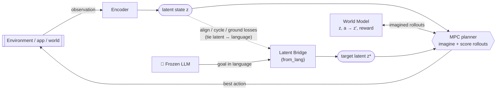

# LatentBridge


**Couple a frozen LLM to a trained world model through a learned latent bridge, and
plan inside the world model toward a goal given in language.**

Most LLM-agent stacks are *reactive*: a model looks at an observation and emits an
action. **LatentBridge is model-based** — a frozen LLM states the goal in language, a
small **learned bridge** maps that language into the world model's latent space, and a
**model-predictive controller** plans by imagining rollouts inside the learned model.

## Architecture



*Encoder, world model and bridge are **learned**; the LLM stays **frozen** and only
states the goal in language. The bridge is what lets that language **steer the
planning** inside the latent world model — that connector, applied to one new domain,
is the contribution.*

> **Honest framing.** This is a *recombination* of known ideas (learned world
> models, frozen-LLM conditioning, MPC), assembled into one loop and **measured**.
> The contribution is the assembly + its evaluation, not a single new layer. No
> result here is claimed that the benchmark doesn't reproduce. Results are
> small-scale and CPU — they demonstrate the *mechanism*, not SOTA scale.

## The core idea, made measurable

In every environment the **goal is hidden from the observation** and given **only
in language**. So the `LLM → bridge → world-model` channel is the *only* way to
solve the task — which makes the bridge's value directly measurable:

- **`guidance_gain` = success WITH the bridge − success WITHOUT it** (held-out).
- A **no-bridge ablation** runs as the control. If the bridge weren't doing the
  work, the ablation would match it.

## Quick start

```bash
pip install -e ".[dev]"        # or: pip install -r requirements.txt
pytest                         # fast test suite (~4s CPU) — envs, models, pipeline
# one experiment (gridworld): trains, evaluates on held-out seeds, prints score
python -m latentbridge.experiment --config configs/base.yaml
# the full benchmark with the no-bridge control group:
python benchmark/run_benchmark.py --ablation
```

See [`benchmark/RESULTS.md`](benchmark/RESULTS.md) for the reproduced numbers and
[`benchmark/README.md`](benchmark/README.md) for the methodology.

## What's inside

```
latentbridge/    encoder · world model · latent bridge · MPC controller · LLM planner
configs/         one YAML per world (gridworld, lifeworld, physics 2D/3D/vision, desktop, calc)
loop/            continuous architecture search (measure-don't-guess)
benchmark/       reproducible benchmark + results
scripts/         measure.py, wm_probe.py (drift), few-shot / in-context experiments
```

The MPC supports two trajectory optimizers (`control.optimizer`): `shooting`
(uniform random shooting, the default) and `cem` (cross-entropy method at the
same rollout budget — `n_samples` split across `cem_iters` refit iterations).
Measured guidance (3 seeds, equal budget): shooting is the better default —
CEM scores worse on gridworld (4^5 sequences vs 256 samples: uniform sampling
already covers the space) and only matches shooting on desktopworld (11^6 vs
512). CEM's measured win is confined to sharp rare-optimum landscapes (see
`tests/test_cem.py`); on these learned reward surfaces concentration does not
pay, so treat it as an opt-in experiment knob, not a recommendation.

## Highlights (reproduced by the benchmark)

- The bridge **transfers across worlds** — the same architecture solves gridworld,
  a synthetic "day", continuous physics, and a simulated GUI desktop, with a
  positive `guidance_gain` and a no-bridge ablation that collapses.
- A **recurrent (RSSM-style) world model** roughly **halves** multi-step
  imagination drift and wins long-horizon control over the feedforward model.
- **In-context few-shot** (`scripts/incontext_fewshot.py`): an attention
  meta-learner infers an *unseen* environment's dynamics from a handful of
  observations — **no retraining** (accuracy climbs with context).

## Comparison vs baselines (honest)

The repo ships reference baselines and an **equal-budget, multi-seed** comparison
harness (`latentbridge/benchmark.py`, `latentbridge/baselines/`): `random` (floor),
`ppo` / `dqn` (model-free RL), `llm-only` (planner goal, no world model),
`world-model` (LatentBridge with the bridge ablated = control), and `latentbridge`.

```bash
python -m latentbridge.benchmark --config configs/base.yaml --seeds 5 --budget 80 --regime both
python -m latentbridge.benchmark --config configs/minigrid.yaml --seeds 5 --budget 120 --regime visible
```

Reproduced numbers in [`BENCHMARK_RESULTS.md`](BENCHMARK_RESULTS.md):

- **More sample-efficient than model-free RL at equal budget** — gridworld 0.46 vs
  PPO 0.05 / DQN 0.12; MiniGrid-Empty 0.64 vs PPO/DQN **0.00**.
- The **bridge helps when the goal is hidden** (language-only regime, +0.28 over the
  control) and is **neutral/negative when the goal is observable** — reported, not hidden.
- Also runs on the **public MiniGrid** env (`configs/minigrid.yaml`), the same harness,
  no code change (swap `env_id` for BabyAI multi-goal missions).

> Honesty (`integrations/BENCHMARKING.md`): until the same harness clears a public
> benchmark at scale, the claim is *"promising, more sample-efficient than PPO/DQN at
> equal budget"* — **not** "state of the art".

## Methodology & roadmap

- `AGENTS.md` — the *measure-don't-guess* contract (never claim an unmeasured
  improvement; a control group runs every generation; the judge is off-limits).
- `integrations/EMBODIMENT.md` — the abstraction ladder toward a body.
- `integrations/EVOLUTION.md` — "it learns from experience, it isn't programmed".

## License

MIT — see [LICENSE](LICENSE).
